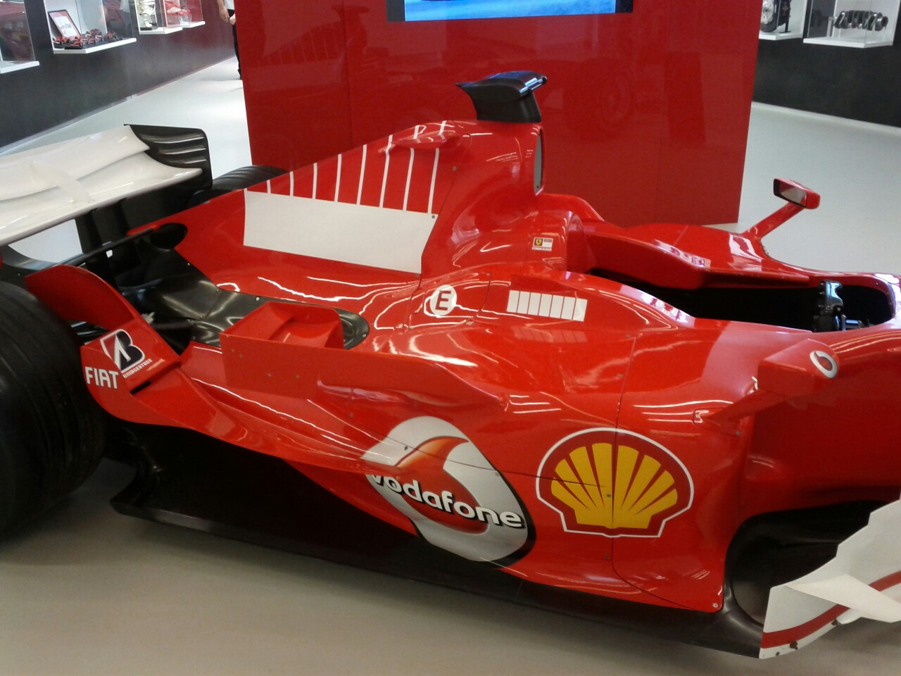
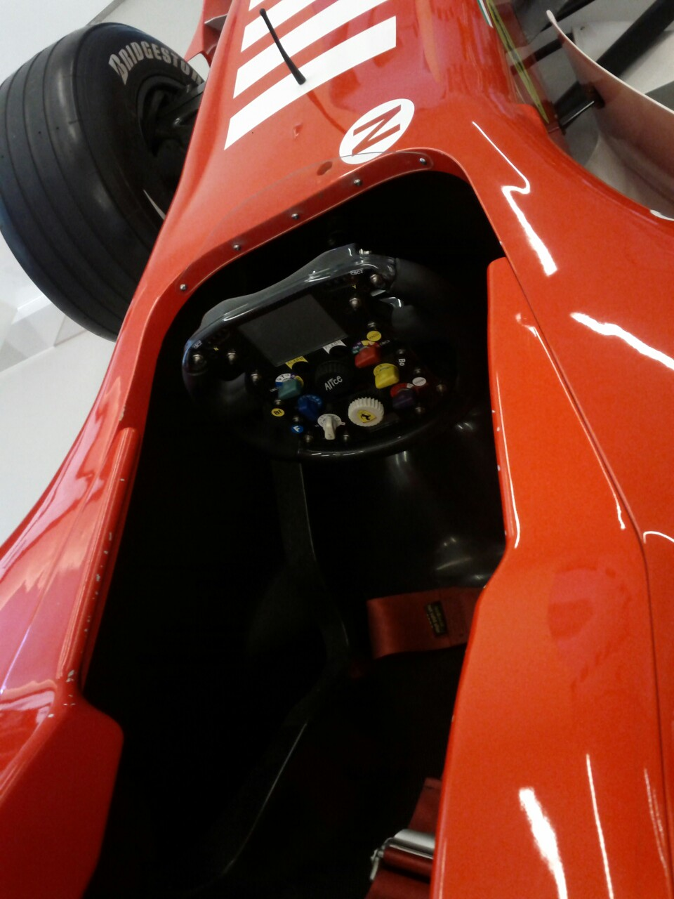
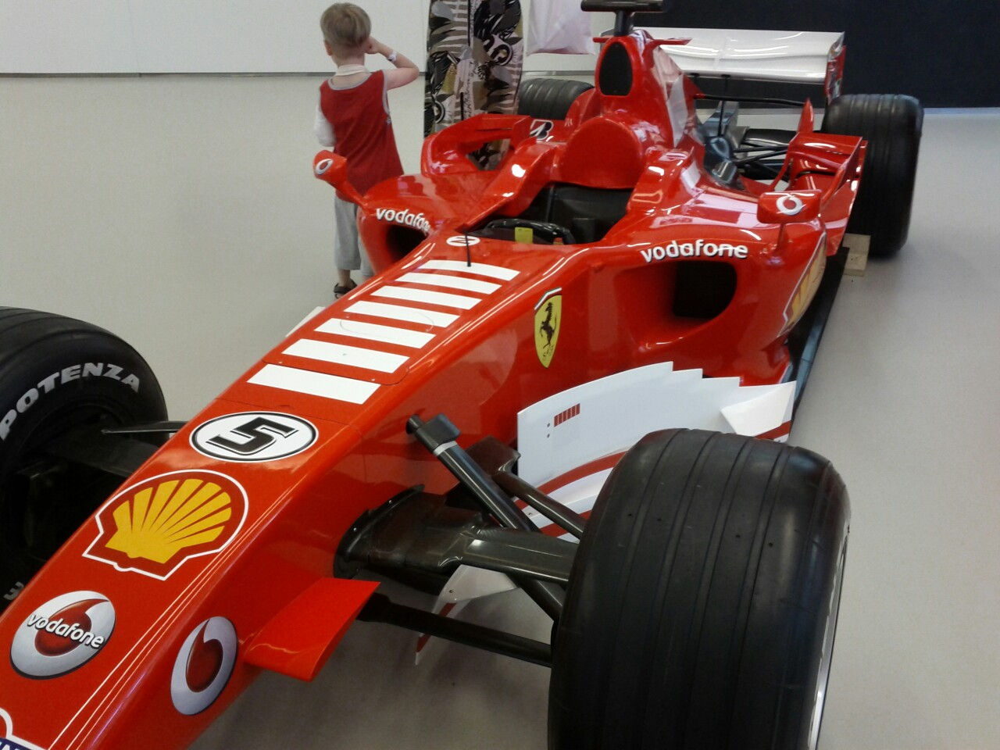
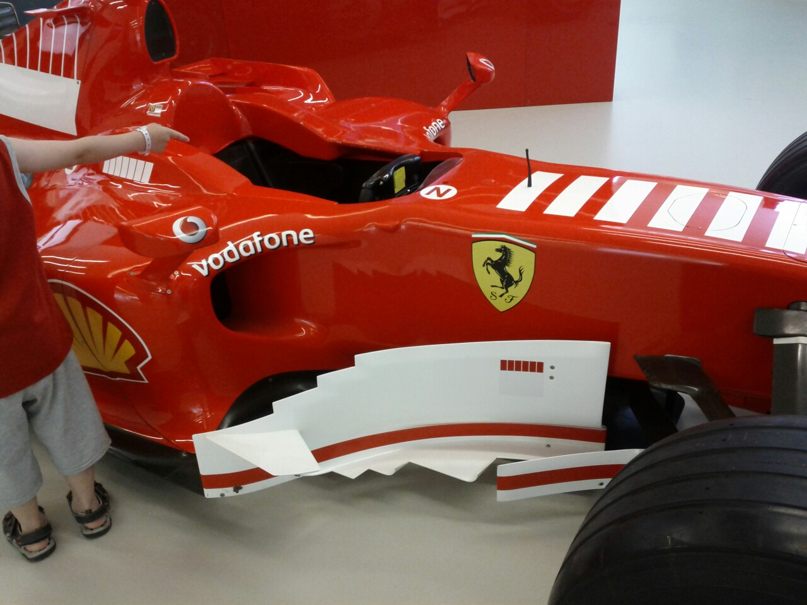
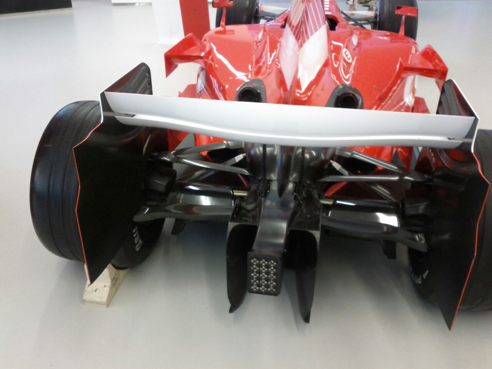

Came across the Ferrari dealership in Tel-Aviv yesterday, and found out they have a [2006 248 F1][1] car on display. The car has Schumacher&#8217;s name on it, though I don&#8217;t know if it was actually ever driven in a grand prix. Still &#8211; I got excited like a little boy when I saw it!

<figure class="wp-block-gallery columns-2 is-cropped">
  <ul class="blocks-gallery-grid">
    <li class="blocks-gallery-item">
      <figure></figure>
    </li>
    <li class="blocks-gallery-item">
      <figure></figure>
    </li>
    <li class="blocks-gallery-item">
      <figure></figure>
    </li>
    <li class="blocks-gallery-item">
      <figure></figure>
    </li>
    <li class="blocks-gallery-item">
      <figure></figure>
    </li>
  </ul>
</figure>

 [1]: http://en.wikipedia.org/wiki/Ferrari_248_F1