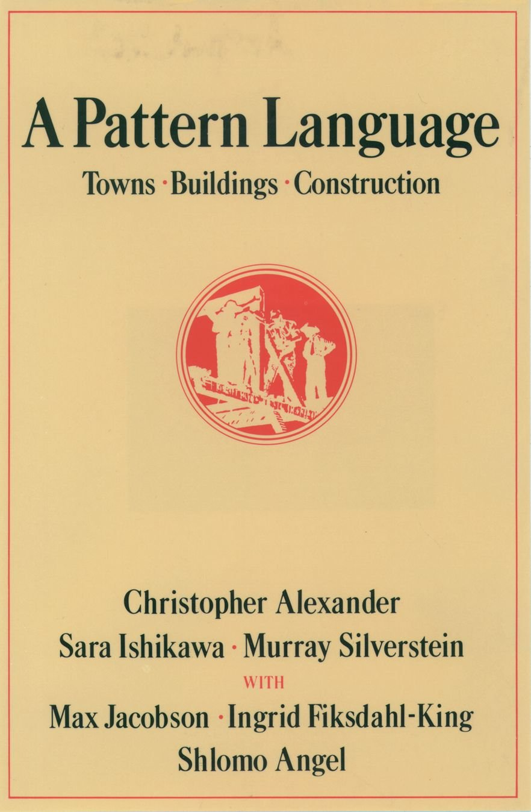

I stumbled on the Cool Tools [review][1] of the book &#8220;[A Pattern Language][2]&#8221; a couple of years ago. Knowing then that we&#8217;ll soon be planning and building our house, I was excited to learn of a book that could help me build-up some basic knowledge and understanding of architecture.

  <figure class="aligncenter size-large is-resized"></figure>

&#8220;A Pattern Language&#8221; is fantastic! The amount of practical yet easy-to-digest information is staggering, and the book&#8217;s structure makes it very easy to use. The authors describe 253 patterns with varying importance, spanning across three main sections (_Towns_, _Buildings_, _Construction_). Each pattern references the patterns it&#8217;s built on top of and the patterns it affects.

Reading through &#8220;A Pattern Language&#8221; (and going back to it again and again) has given me the confidence I needed to critically look at our house plans, noticing how the patterns are applied (or not!). If you&#8217;re ever going to be involved in a construction or serious remodeling project, I recommend getting yourself a copy.

 [1]: https://kk.org/cooltools/a-pattern-language/
 [2]: https://en.wikipedia.org/wiki/A_Pattern_Language