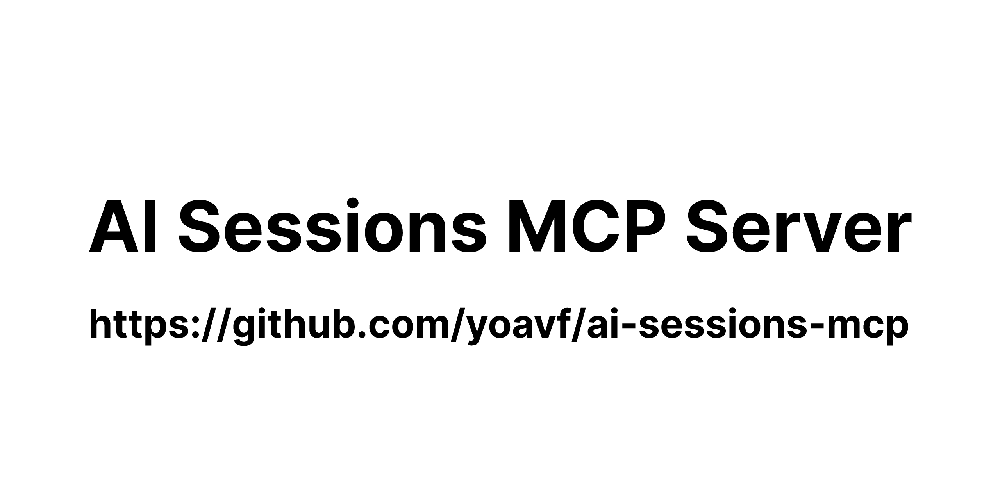

I've been switching between Claude Code and Codex a lot lately, and losing context each time was getting annoying.

So I built [AI Sessions MCP][1] - a small local server that lets any MCP-compatible AI agent read your coding sessions from Claude Code, Codex, Gemini CLI, and opencode.

[][1]

Install it once, point your agents at it, and they can all access your session history. Search past conversations, find solutions to similar problems, or resume work in a different tool.

Everything stays local. The server just reads the session files these tools already save to disk.

If you're juggling multiple AI coding agents, [give it a try][1]. Contributions for additional adapters are welcome.

 [1]: https://github.com/yoavf/ai-sessions-mcp
