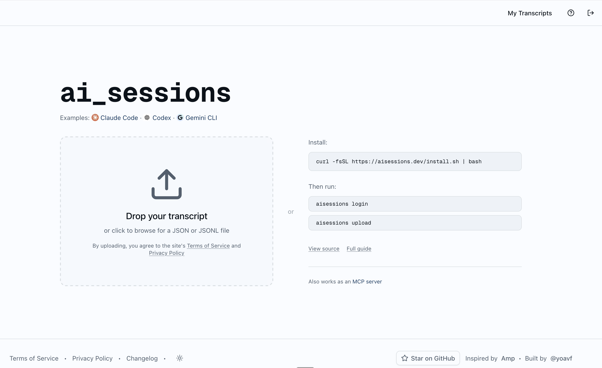

A few weeks ago I released [aisessions.dev](https://aisessions.dev), a site where you can share your Claude Code / Codex / Gemini CLI sessions with others. In some ways this is an extension of the [MCP server][2] of the same name I created.

[][1]

This was a fun zero-to-one project and an opportunity to think through a number of challenges:
- Safely accepting user generated data (security, PII scrubbing, etc)
- Building a privacy conscious service
- Designing for long-term low-maintenance operation
- Developer experience - CLI tools, onboarding, and good defaults ()
- UI, design, and simplicity
- Keeping everything [open source](https://github.com/yoavf/ai-sessions)

The stack this time was next.js + postgres (neon) + redis (upstash) + GCP Sensitive Data Protection. Hosted on Vercel.

[1]: https://aisessions.dev
[2]: http://localhost:1313/2025/10/04/ai-sessions-mcp/
