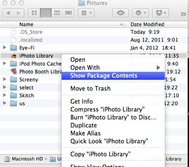
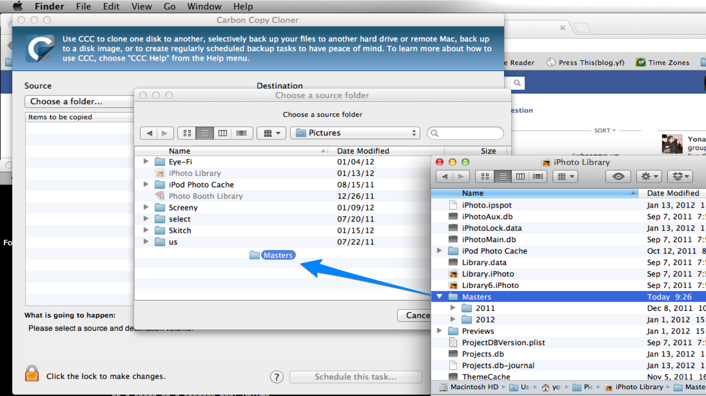

When I started using iPhoto, I didn&#8217;t realize my images are all enclosed inside a single package file. This is annoying because I&#8217;m used to having all my photos on a network share for easy access from PCs and other devices.

It turns out directly accessing images from iPhoto in the finder isn&#8217;t too difficult &#8211; you just need to &#8220;Show Package Contents&#8221; on the iPhoto library file, and navigate to the &#8220;Master&#8221; folder. However regularly backing up those images is a little more tricky.

If you&#8217;ve ever wanted to back up just the images from inside your iPhoto library to an external drive, a network share etc, then this is how you do it with the excellent Carbon Copy Cloner:

  1. In CCC&#8217;s main window, select &#8220;Choose a folder&#8221; from the source drop down. A folder navigation window will open.
  2. Ignore it for now and open a general finder window &#8211; navigate to your iPhoto library file location (usually under Pictures in your user account folder), and right-click on the iPhoto Library file and select on &#8220;Show Package Contents&#8221; from the pop-up menu.  
      
    [  
][1] 
  3. Now drag the &#8220;Masters&#8221; folder directly into CCC&#8217;s folder navigation window. That&#8217;s it &#8211; just select your destination and click on clone.  
      
    [  
][2] 

 [1]: images/iphoto1.png
 [2]: images/iphoto2.png