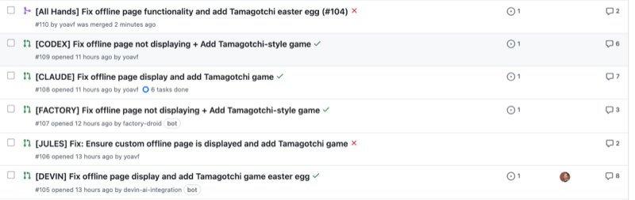

I threw an issue from a side project at 6 AI tools today: [Claude Code][1], OpenAI Codex (the [CLI version][2]), [Factory.ai][3], [Devin][4], [Jules][5], and [All Hands][6].<figure class="wp-block-image size-large has-lightbox has-lightbox">

 </figure> 

The task was a bug fix + feature. The tricky part: it required setting the browser to offline mode for testing.

### **Results** {.wp-block-heading}

None of the agents resolved the issue in one-shot, though eventually **All Hands** got the job done and its PR was merged. 

Initially 5 out of 6 tools failed in exactly the same way. They all made the same wrong assumption about how a specific library config worked, which meant the underlying bug never got fixed. Most implemented the requested feature perfectly, but it was useless without the bug fix since they were interconnected.

<ul class="wp-block-list">
  <li>
    <strong>All Hands</strong> eventually got it done after a few iterations and me pointing it to a specific example online. Easiest to work with iteratively. I&#8217;m planning to also give <a href="https://github.com/All-Hands-AI/OpenHands">Open Hands</a> (the self-hosted version) a try.
  </li>
  <li>
    <strong>Devin</strong> felt the most polished and capable of the hosted agents, but it seems to also be the most expensive &#8211; I ran out of credits before I could iterate properly.
  </li>
  <li>
    <strong>Factory.ai</strong> &#8211; Might have solved it with more time (I maxed out the usage of my free trial), though this enterprise-ready tool is probably overkill for my little side project.
  </li>
  <li>
    <strong>Jules</strong> completely hallucinated the issue content and implemented something totally different (despite being connected to GitHub &#8211; not sure what happened there).
  </li>
  <li>
    Both <strong>Claude Code</strong> and <strong>Codex</strong> are pretty capable. Claude Code is what I&#8217;m mainly using now for agentic coding, but I&#8217;m planning to spend more time with Codex.
  </li>
</ul>

This isn&#8217;t a scientific review, obviously &#8211; just a quick experiment on real code. But the patterns were interesting enough to share.

Well, that was fun, but way too much time spent on an offline mode easter egg for an unreleased side project 🙂

 [1]: https://www.anthropic.com/claude-code
 [2]: https://github.com/openai/codex
 [3]: https://www.factory.ai/
 [4]: https://devin.ai/
 [5]: https://jules.google.com/
 [6]: https://www.all-hands.dev/