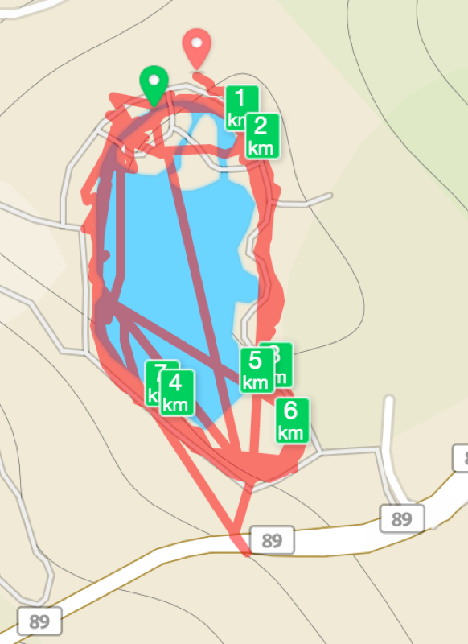

I started running a few months ago, with [Runkeeper][1] as my running app. The UI made sense, the audio cues were useful, and I liked the fact that friends were using it too and sharing their efforts.

Yet, too often my runs appeared like this:

<figure id="attachment_1590" aria-describedby="caption-attachment-1590" style="width: 504px" class="wp-caption alignnone"><figcaption id="caption-attachment-1590" class="wp-caption-text">I can run on water</figcaption></figure>

I&#8217;m inclined to blame the phone&#8217;s GPS, but I expect the app to be smart and average my position to figure out I didn&#8217;t make impossible jumps across the lake. This was especially confusing during runs when I was doing intervals.

After I&#8217;ve tested a bunch of the other available apps ([Map My Run][2], [Endomondo][3], [Nike+ Running][4], [Strava][5], and more), I&#8217;ve chosen [Runtastic Pro][6], and I&#8217;m really happy with it. Not only has the GPS data been flawless, it also supports HR zones alerts which Runkeeper lacks.

While slightly more complex, Runtastic feels much more powerful too &#8211; it&#8217;s super configurable, and has a bunch of fun and interesting features.

The only downside for me is the lack of community, since all my friends are on Runkeeper. Luckily, there&#8217;s [SyncMyTracks][7] (and a limited [free][8] version) which can automatically sync activities between the different platforms.

&nbsp;

&nbsp;

 [1]: https://runkeeper.com/
 [2]: https://play.google.com/store/apps/details?id=com.mapmyrun.android2
 [3]: https://play.google.com/store/apps/details?id=com.endomondo.android
 [4]: https://play.google.com/store/apps/details?id=com.nike.plusgps&hl=en
 [5]: https://play.google.com/store/apps/details?id=com.strava
 [6]: https://play.google.com/store/apps/details?id=com.runtastic.android.pro2
 [7]: https://play.google.com/store/apps/details?id=com.syncmytracks
 [8]: https://play.google.com/store/apps/details?id=com.syncmytracks.free