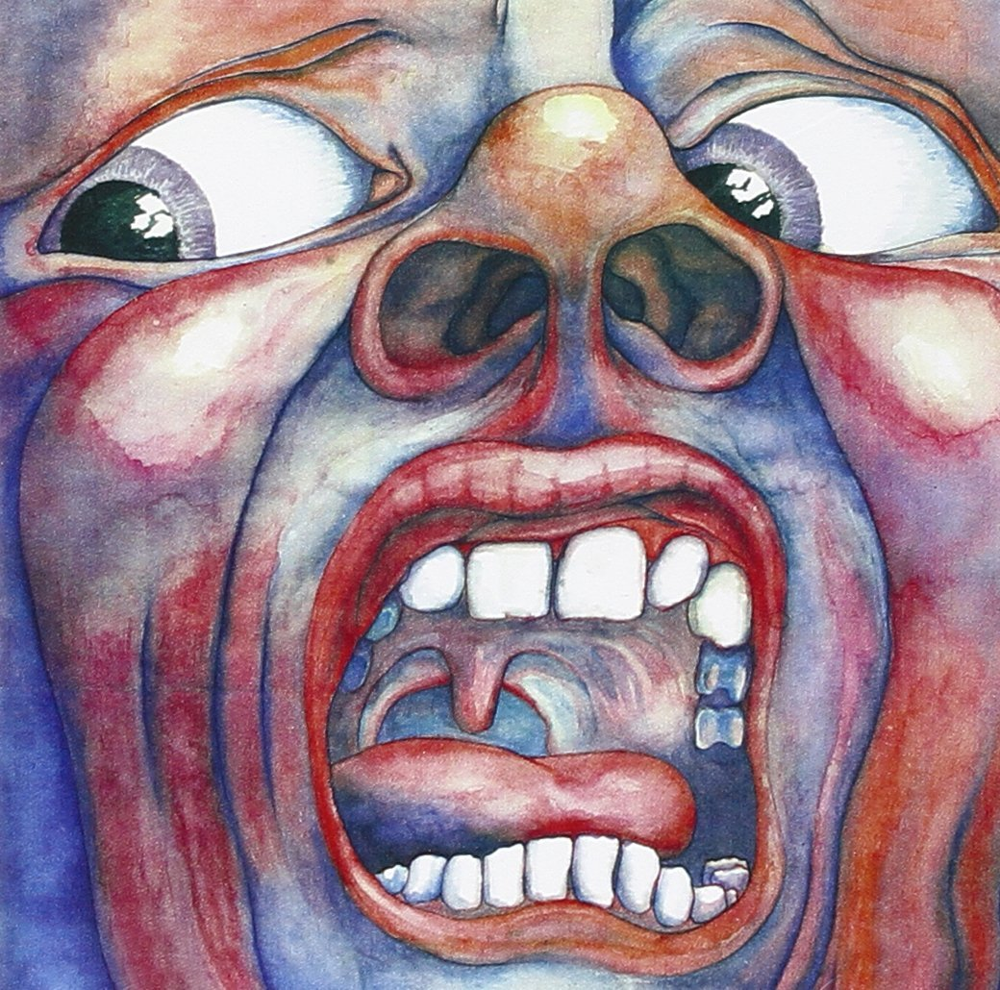

King Crimson&#8217;s [In the Court of the Crimson King][1] is the album that made me fall in love with Prog Rock. [Greg Lake][2]&#8216;s powerful vocals on the track _Epitaph_ have much to do with this.

<figure class="wp-block-image aligncenter">
  
</figure>

Written around 1969, the **lyrics** (by Pete Sinfield) are _[almost prophetic][3]:_

> The wall on which the prophets wrote  
> Is cracking at the seams  
> Upon the instruments of death  
> The sunlight brightly gleams  
> When every man is torn apart  
> With nightmares and with dreams,  
> Will no one lay the laurel wreath  
> As silence drowns the screams
> 
> [&#8230;]
> 
> Knowledge is a deadly friend  
> If no one sets the rules  
> The fate of all mankind I see  
> Is in the hands of fools

Greg Lake [passed away][4] this week, at 69.

<iframe width="560" height="315" src="https://www.youtube.com/embed/Jir4GXxUJao?si=cugdcTdd3vYn2_4j" title="YouTube video player" frameborder="0" allow="accelerometer; autoplay; clipboard-write; encrypted-media; gyroscope; picture-in-picture; web-share" referrerpolicy="strict-origin-when-cross-origin" allowfullscreen></iframe>

 [1]: https://en.wikipedia.org/wiki/In_the_Court_of_the_Crimson_King
 [2]: https://en.wikipedia.org/wiki/Greg_Lake
 [3]: http://www.jerrylucky.com/commentaries_087.htm
 [4]: http://www.rollingstone.com/music/news/greg-lake-emerson-lake-palmer-co-founder-dead-at-69-w454546