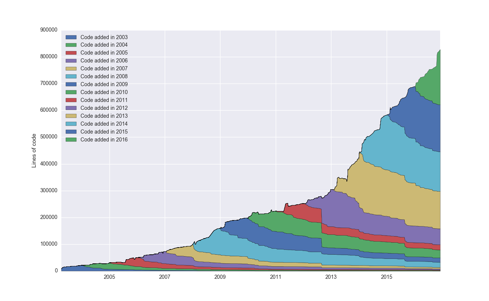
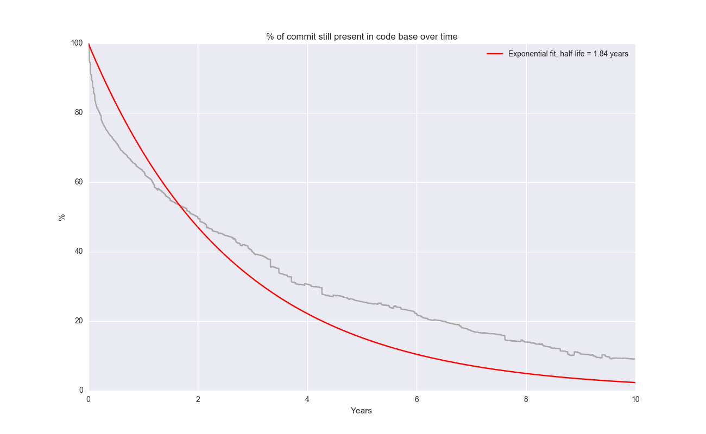

Inspired by Erik Bernhardsson post [The half-life of code & the ship of Theseus][1], here are the results of running Erik&#8217;s [scripts][2] against the WordPress git [repo][3].

### Cohorts

[][4]

### Code decay over time

[][5]

 [1]: https://erikbern.com/2016/12/05/the-half-life-of-code.html
 [2]: https://github.com/erikbern/git-of-theseus
 [3]: //develop.git.wordpress.org/
 [4]: images/stack_plot.png
 [5]: images/survival-half-life1.png