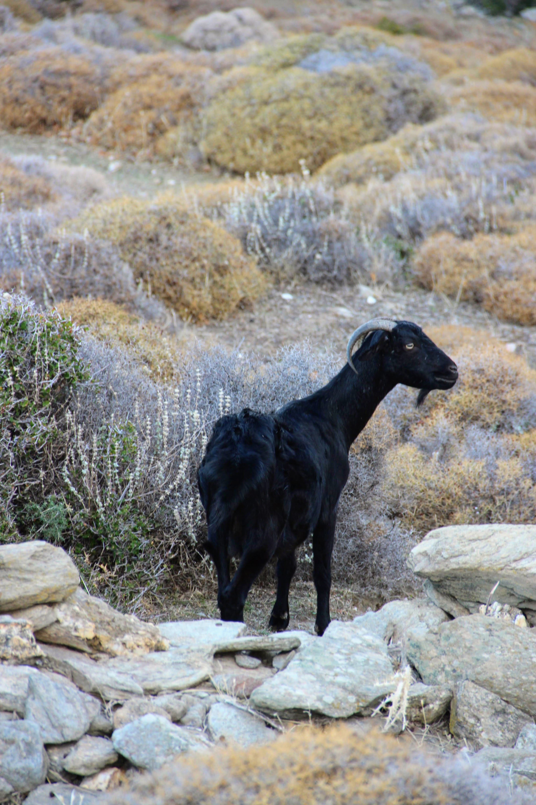
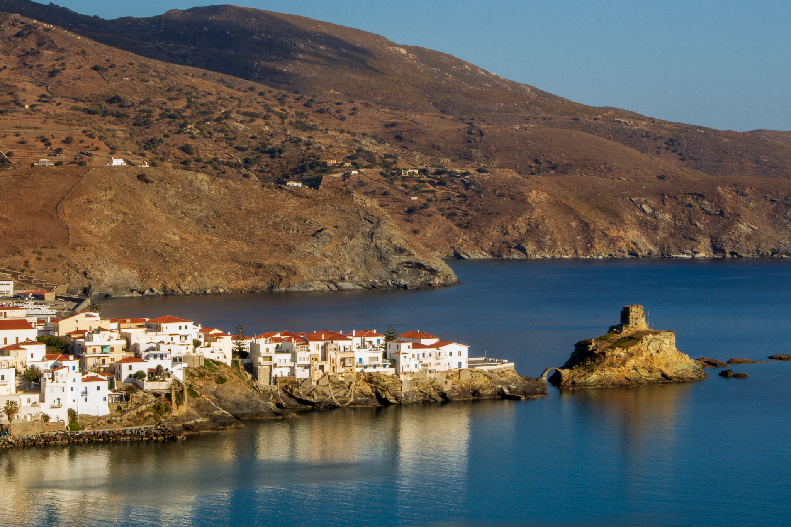
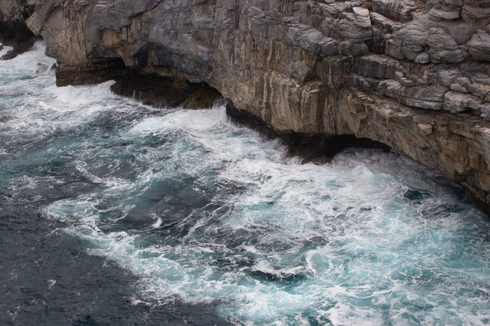
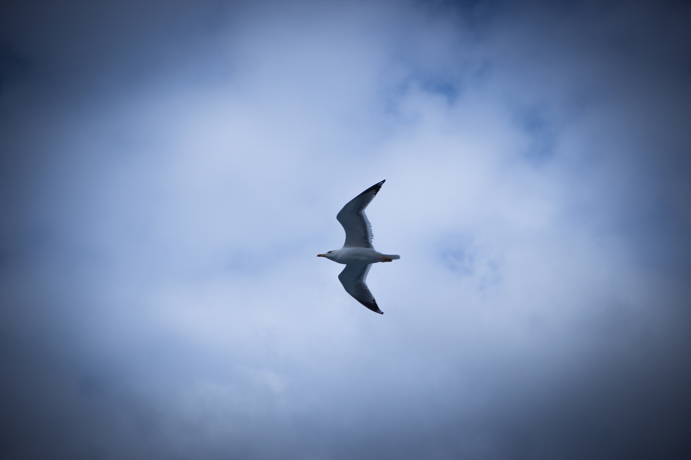
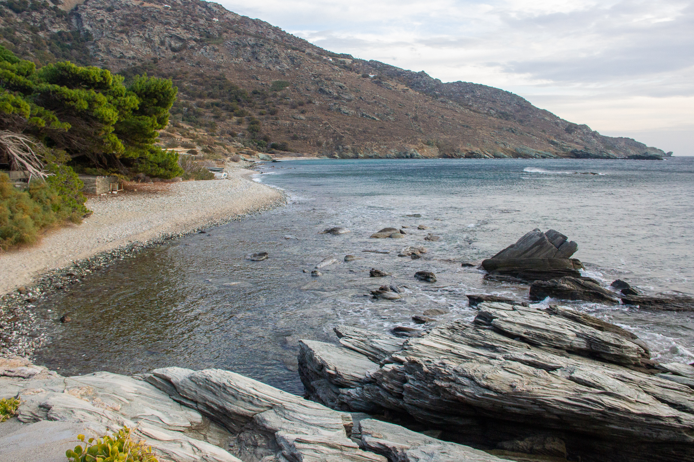

At the end of October 2021, I traveled to the island of Andros in Greece for a solo hiking trip.

The [official Andros route][1] covers 100km in 10 days. I took inspiration from [this excellent variation][2] posted on the &#8220;Hiking and Coding&#8221; blog and came up with a modified itinerary where I&#8217;d walk about 90km in 5 days. I eventually covered that distance but made some changes along the way. This post is a photo diary of my itinerary. 

  
  
  

    

      Arrival
    

  

My ferry to the port of Gavrio arrived in the early afternoon, and I hopped on a taxi to my starting point, the town of Batsi. I stayed at the Karanasos hotel, where I met Dimitris, who shared many helpful hiking tips and an excellent [up-to-date map of all the hiking trails][3].

  
  
  

    

      Day 1: Batsi to Arni
    

  

<ul class="wp-block-list">
  <li>
    Routes: 11
  </li>
  <li>
    Total distance: 10km
  </li>
  <li>
    Ascent: 731m, Decent: 285m
  </li>
</ul>

My first hike followed the &#8220;[day 3 itinerary][4]&#8221; of the official Andros route: relatively short, sticking to [route 11][5] all the way.<figure class="wp-block-gallery columns-4 is-cropped wp-block-gallery-1 is-layout-flex wp-block-gallery-is-layout-flex">

<ul class="blocks-gallery-grid">
  <li class="blocks-gallery-item">
    <figure><figcaption class="blocks-gallery-item__caption">Batsi</figcaption></figure>
  </li>
  <li class="blocks-gallery-item">
    <figure><figcaption class="blocks-gallery-item__caption">Batsi</figcaption></figure>
  </li>
  <li class="blocks-gallery-item">
    <figure><figcaption class="blocks-gallery-item__caption">A recurring theme: goat</figcaption></figure>
  </li>
  <li class="blocks-gallery-item">
    <figure><figcaption class="blocks-gallery-item__caption">A fork in the road. The signage was excellent all through the week.</figcaption></figure>
  </li>
  <li class="blocks-gallery-item">
    <figure></figure>
  </li>
  <li class="blocks-gallery-item">
    <figure></figure>
  </li>
  <li class="blocks-gallery-item">
    <figure></figure>
  </li>
  <li class="blocks-gallery-item">
    <figure></figure>
  </li>
</ul></figure> 

  <figure class="aligncenter"><figcaption>Αγία Άννα &#8211; Saint Anna church</figcaption></figure>

I arrived at the village of Arni at lunchtime and headed to the Magic Mountain, the island&#8217;s animal shelter, where I rented the [Magic Room][6] for the night. I had a lot of fun hanging out with the animals, especially the dogs, and the donkeys.<figure class="wp-block-gallery columns-2 is-cropped wp-block-gallery-2 is-layout-flex wp-block-gallery-is-layout-flex">

<ul class="blocks-gallery-grid">
  <li class="blocks-gallery-item">
    <figure><figcaption class="blocks-gallery-item__caption">Jackass (and Donkey)</figcaption></figure>
  </li>
  <li class="blocks-gallery-item">
    <figure><figcaption class="blocks-gallery-item__caption">Tip: bring some dog treats 🙂</figcaption></figure>
  </li>
</ul></figure> 

  
  
  

    

      Day 2: Arni to Chora (Andros Town)
    

  

<ul class="wp-block-list">
  <li>
    Routes: 12, 2
  </li>
  <li>
    Total Distance: 15.8km
  </li>
  <li>
    Ascent: 813m, Descent: 1,209m
  </li>
</ul>

I started with the &#8220;[day 4][7]&#8221; hike from the official route to Apikia, then continued on [route 2][8] all the way to Chora (Andros Town). The weather was quite windy, making for a challenging climb to (and descent from) Kouvara, Andros&#8217; highest peak.

<figure class="wp-block-gallery columns-3 is-cropped">
  <ul class="blocks-gallery-grid">
    <li class="blocks-gallery-item">
      <figure></figure>
    </li>
    <li class="blocks-gallery-item">
      <figure></figure>
    </li>
    <li class="blocks-gallery-item">
      <figure></figure>
    </li>
    <li class="blocks-gallery-item">
      <figure><figcaption class="blocks-gallery-item__caption">Óros Kouvára</figcaption></figure>
    </li>
  </ul>
</figure>

<figure class="wp-block-image">
  
</figure> 

I was exhausted when I arrived in Chora and decided to stay there an extra day. Since it was already off-season, it wasn&#8217;t too difficult to change the hotel reservations I had already placed for the rest of the week. 

  
  
  

    

      Day 3: Around Chora
    

  

<ul class="wp-block-list">
  <li>
    Route: 17
  </li>
  <li>
    Total distance: ~6km
  </li>
</ul>

Rest day! Leaving my backpack in the hotel, I enjoyed a leisurely walk on the circular [route 17][10] through Livadia.

<figure class="wp-block-gallery columns-3 is-cropped">
  <ul class="blocks-gallery-grid">
    <li class="blocks-gallery-item">
      <figure></figure>
    </li>
    <li class="blocks-gallery-item">
      <figure></figure>
    </li>
    <li class="blocks-gallery-item">
      <figure></figure>
    </li>
    <li class="blocks-gallery-item">
      <figure></figure>
    </li>
    <li class="blocks-gallery-item">
      <figure></figure>
    </li>
    <li class="blocks-gallery-item">
      <figure></figure>
    </li>
    <li class="blocks-gallery-item">
      <figure></figure>
    </li>
    <li class="blocks-gallery-item">
      <figure></figure>
    </li>
    <li class="blocks-gallery-item">
      <figure></figure>
    </li>
  </ul>
</figure>

Later I strolled through the main village, crossing the bridge to the Andros Castle to get a nice view of the beautiful Tourlitis Lighthouse.

  

    

      

        <figure class="tiled-gallery__item"></figure><figure class="tiled-gallery__item"></figure>
      

      

        <figure class="tiled-gallery__item"></figure>
      

    

    

      

        <figure class="tiled-gallery__item"></figure><figure class="tiled-gallery__item"></figure><figure class="tiled-gallery__item"></figure>
      

      

        <figure class="tiled-gallery__item"></figure>
      

    

  

  
  
  

    

      Day 4: Chora to Ormos Korthi
    

  

<ul class="wp-block-list">
  <li>
    Routes: 3, 3b
  </li>
  <li>
    Total distance: 14.1km
  </li>
  <li>
    Ascent: 704m, Decent: 743m
  </li>
</ul>

As I set off from Chora to Korthi, I followed [route number 3][11] all the way, only making a detour with route 3b to visit the castle of Faneromeni. Following the advice found in [this excellent post][2], I stashed my backpack in one of the goat sheds at the start of 3b, which made the steep climb to the castle much easier.<figure class="wp-block-gallery columns-3 is-cropped wp-block-gallery-5 is-layout-flex wp-block-gallery-is-layout-flex">

<ul class="blocks-gallery-grid">
  <li class="blocks-gallery-item">
    <figure><figcaption class="blocks-gallery-item__caption">Chora from route #3</figcaption></figure>
  </li>
  <li class="blocks-gallery-item">
    <figure></figure>
  </li>
  <li class="blocks-gallery-item">
    <figure></figure>
  </li>
  <li class="blocks-gallery-item">
    <figure></figure>
  </li>
  <li class="blocks-gallery-item">
    <figure></figure>
  </li>
  <li class="blocks-gallery-item">
    <figure></figure>
  </li>
  <li class="blocks-gallery-item">
    <figure><figcaption class="blocks-gallery-item__caption">The church next to the castle</figcaption></figure>
  </li>
  <li class="blocks-gallery-item">
    <figure><figcaption class="blocks-gallery-item__caption">Castle ruins and the church</figcaption></figure>
  </li>
  <li class="blocks-gallery-item">
    <figure><figcaption class="blocks-gallery-item__caption">View of Korthi</figcaption></figure>
  </li>
</ul></figure> 

The detour was well worth it: throughout the castle were panels with historical and archeological information. The views were magnificent.<figure class="wp-block-gallery has-nested-images columns-default is-cropped wp-block-gallery-6 is-layout-flex wp-block-gallery-is-layout-flex"> <figure class="wp-block-image size-large">

[][12]<figcaption>Castle Panorama</figcaption></figure> </figure> 

Korthi&#8217;s beach is one of the most beautiful I&#8217;ve ever seen. It was pretty cold already, but I couldn&#8217;t resist a little swim in the crystal clear water. Later that evening, I went for a walk around the village.

  

    

      

        <figure class="tiled-gallery__item"></figure><figure class="tiled-gallery__item"></figure>
      

      

        <figure class="tiled-gallery__item"></figure>
      

    

  

  
  
  

    

      Day 5: Ormos Korthi to Menites  (via Panachrantou Monastery)
    

  

<ul class="wp-block-list">
  <li>
    Routes: 5, <s>18</s>, 1
  </li>
  <li>
    Total distance: 14.45km
  </li>
  <li>
    Ascent: 880m, Decent: 707m
  </li>
</ul>

My original plan was to follow [route 5][13] to Vrachnou, then take [routes 18][14] and [1][15], including a detour to the Panachrantou Monastery.

As I climbed the many steps uphill from Korthiou, I felt exhausted: the day was hot and my backpack heavy. When I reached the village of Mesa Vouni, I went off the hiking trail and took the road directly to the monastery. After a quick visit, I continued on route 1 to Menites.<figure class="wp-block-gallery columns-3 is-cropped wp-block-gallery-7 is-layout-flex wp-block-gallery-is-layout-flex">

<ul class="blocks-gallery-grid">
  <li class="blocks-gallery-item">
    <figure><figcaption class="blocks-gallery-item__caption">Transporting construction materials</figcaption></figure>
  </li>
  <li class="blocks-gallery-item">
    <figure><figcaption class="blocks-gallery-item__caption">The turkey herder</figcaption></figure>
  </li>
  <li class="blocks-gallery-item">
    <figure><figcaption class="blocks-gallery-item__caption">Light through the monastery</figcaption></figure>
  </li>
  <li class="blocks-gallery-item">
    <figure><figcaption class="blocks-gallery-item__caption">A monastery cat</figcaption></figure>
  </li>
  <li class="blocks-gallery-item">
    <figure></figure>
  </li>
  <li class="blocks-gallery-item">
    <figure></figure>
  </li>
</ul></figure> 

The closer I got to Menites, the more water was present everywhere: streams flowing, gently leading me to the end of the route.<figure class="wp-block-gallery columns-3 is-cropped wp-block-gallery-8 is-layout-flex wp-block-gallery-is-layout-flex">

<ul class="blocks-gallery-grid">
  <li class="blocks-gallery-item">
    <figure></figure>
  </li>
  <li class="blocks-gallery-item">
    <figure></figure>
  </li>
  <li class="blocks-gallery-item">
    <figure></figure>
  </li>
</ul></figure> <figure class="wp-block-video wp-block-embed is-type-video is-provider-videopress">

 

</figure> 

  
  
  

    

      Day 6: Menites to Batsi
    

  

<ul class="wp-block-list">
  <li>
    Route: 9b, 9, 11a, 11
  </li>
  <li>
    Total distance: 17.14km
  </li>
  <li>
    Ascent: 650m, descent 825m
  </li>
</ul>

This day&#8217;s view was breathtaking &#8211; especially after the initial climb from Menites to Pitrofos when road 9 takes you through the cliffs above the western seafront of the island. 

I initially planned to add a detour to Paleiopolis on route 9a but decided to skip it and do that another day.<figure class="wp-block-gallery columns-3 is-cropped wp-block-gallery-9 is-layout-flex wp-block-gallery-is-layout-flex">

<ul class="blocks-gallery-grid">
  <li class="blocks-gallery-item">
    <figure><figcaption class="blocks-gallery-item__caption">Early morning sunshine</figcaption></figure>
  </li>
  <li class="blocks-gallery-item">
    <figure></figure>
  </li>
  <li class="blocks-gallery-item">
    <figure></figure>
  </li>
  <li class="blocks-gallery-item">
    <figure></figure>
  </li>
  <li class="blocks-gallery-item">
    <figure></figure>
  </li>
  <li class="blocks-gallery-item">
    <figure></figure>
  </li>
  <li class="blocks-gallery-item">
    <figure></figure>
  </li>
  <li class="blocks-gallery-item">
    <figure></figure>
  </li>
  <li class="blocks-gallery-item">
    <figure></figure>
  </li>
  <li class="blocks-gallery-item">
    <figure></figure>
  </li>
  <li class="blocks-gallery-item">
    <figure><figcaption class="blocks-gallery-item__caption">Batsi and Gavrio from the distance</figcaption></figure>
  </li>
</ul></figure> <figure class="wp-block-gallery has-nested-images columns-default is-cropped wp-block-gallery-10 is-layout-flex wp-block-gallery-is-layout-flex"> <figure class="wp-block-image size-large">

[][16]</figure> </figure> 

When I reached Batsi, I took a cab to Agios Petros, where I&#8217;d spend the next couple of nights.

  
  
  

    

      Day 7: Agios Petros to Gavrio; Zorkos Cave, Paleiopolis
    

  

<ul class="wp-block-list">
  <li>
    3 seperate hikes
  </li>
  <li>
    Routes: 15 and 14, 20, 9a
  </li>
  <li>
    Total distance: 13.5km
  </li>
  <li>
    Ascent: 713m, descent 715m
  </li>
</ul>

I started the day with a hike from Agios Petros to Gavrio on route 15 (and a small part of 14), including a visit to the monumental Hellenistic Tower of Ano Agios Petros.

<figure class="wp-block-gallery columns-2 is-cropped">
  <ul class="blocks-gallery-grid">
    <li class="blocks-gallery-item">
      <figure><figcaption class="blocks-gallery-item__caption">Ano Agios Petros (+me for scale)</figcaption></figure>
    </li>
    <li class="blocks-gallery-item">
      <figure></figure>
    </li>
  </ul>
</figure>

<figure class="wp-block-image">
  
  <figcaption>The port of Gavrio</figcaption>
</figure>

In Gavrio, I rented a car and drove to the island&#8217;s northern part, where I visited Zorkos beach and hiked on route 20 to the fantastic trypes cave. The windy sea was spectacular.

<figure class="wp-block-gallery columns-3 is-cropped">
  <ul class="blocks-gallery-grid">
    <li class="blocks-gallery-item">
      <figure></figure>
    </li>
    <li class="blocks-gallery-item">
      <figure></figure>
    </li>
    <li class="blocks-gallery-item">
      <figure></figure>
    </li>
    <li class="blocks-gallery-item">
      <figure></figure>
    </li>
    <li class="blocks-gallery-item">
      <figure></figure>
    </li>
    <li class="blocks-gallery-item">
      <figure></figure>
    </li>
    <li class="blocks-gallery-item">
      <figure></figure>
    </li>
  </ul>
</figure> 

<ul class="blocks-gallery-grid">
  <li class="blocks-gallery-item">
    <figure class="wp-block-image size-medium"></figure> 
  </li>
  
  <li class="blocks-gallery-item">
    <figure class="wp-block-image size-large"></figure>
  </li>

Before sunset, I drove south to visit the Paleiopolis archeological site and beach (the circular part of [route 9a][18]).

  

    

      

        <figure class="tiled-gallery__item"></figure>
      

      

        <figure class="tiled-gallery__item"></figure><figure class="tiled-gallery__item"></figure>
      

    

    

      

        <figure class="tiled-gallery__item"></figure>
      

      

        <figure class="tiled-gallery__item"></figure>
      

    

  

  
  
  

    

      The end
    

  

This was the first trip of its kind for me, and I learned so much from it. Yes, I could have been better prepared, and I should have carried less weight, but the overall experience was nothing short of amazing. I&#8217;m already looking forward to my next hiking trip.

To wrap up, here are a few general tips and recommendations

#### Food {#food.wp-block-heading}

Travelling off-season meant that quite a few restaurants were closed, but I did enjoy most of the meals I had on the island:

<ul class="wp-block-list">
  <li>
    <strong>Recommended Restaurants</strong>: Stamatis in Batsi, Endochora and Lithi in Chora, Lithodomi in Korthi, O Giannoulis (O Γιαννούλης) in Agios Petros.
  </li>
  <li>
    <strong>Quick bites</strong>: Το Χατσαπούρι in Menites and Hot Spot Pizza Bar in Agios Petros.
  </li>
  <li>
    <strong>Take-away</strong>: There are a few Masoutis minimarkets in Chora and Gavrio where you can find some hot prepared food on the cheap.
  </li>
</ul>

#### Cell coverage {#cell-coverage.wp-block-heading}

I was roaming on the Wind network and had coverage everywhere on the island. I did lose internet connectivity a couple times, but only for a short while. 

#### Car rental {#car-rental.wp-block-heading}

I&#8217;m happy to recommend [Escape in Andros][19] &#8211; their service was perfect, and they were a pleasure to deal with.

#### Covid tests {#covid-tests.wp-block-heading}

If you need to take a covid test before traveling home, you can do that in Chora at [Μικροβιολογικό Άνδρου][20], or at the clinique right next to the Jumbo store in Agios Petros (call [6974026931][21] for info).

 [1]: https://www.androsroutes.gr/andros-route/
 [2]: https://hikingandcoding.wordpress.com/2017/05/20/a-variation-on-the-andros-route/
 [3]: https://goo.gl/maps/eDFqAA61sigAJKNS8
 [4]: https://www.androsroutes.gr/third-day-batsi-katakilos-arni/
 [5]: https://www.androsroutes.gr/north-andros/batsi-katakilos-arni/
 [6]: https://www.airbnb.com/rooms/12349528
 [7]: https://www.androsroutes.gr/fourth-day-arni-prophet-ilias-vourkoti-apikia/
 [8]: https://www.androsroutes.gr/andros-paths-2/central-andros/xwra-apoikia-katakalaioi-vourkwti/
 [9]: images/img_4305-pano-1.jpeg
 [10]: https://www.androsroutes.gr/andros-paths-2/central-andros/chora-livadia/
 [11]: https://www.androsroutes.gr/south-andros/chora-syneti-dipotamata-kohylou-upper-castle-ormos-korthiou/
 [12]: images/pano_20211022_130935.jpeg
 [13]: https://www.androsroutes.gr/south-andros/exw-vouni-mesa-vouni-gannisaio/
 [14]: https://www.androsroutes.gr/andros-paths-2/central-andros/livadia-vraxnou/
 [15]: https://www.androsroutes.gr/andros-paths-2/central-andros/chora-ypsilou-mesathouri-lamyra-menites-mesaria-panachrados-monastery/
 [16]: images/pano_20211024_125801.jpeg
 [17]: images/301edbae-7a89-4691-88f6-1cbf5fc469d1.jpeg
 [18]: https://www.androsroutes.gr/andros-paths-2/central-andros/archaiologikos-palaiopolis/
 [19]: https://escapeinandros.gr/
 [20]: https://www.facebook.com/mikroviologikoandros/
 [21]: tel:6974026931