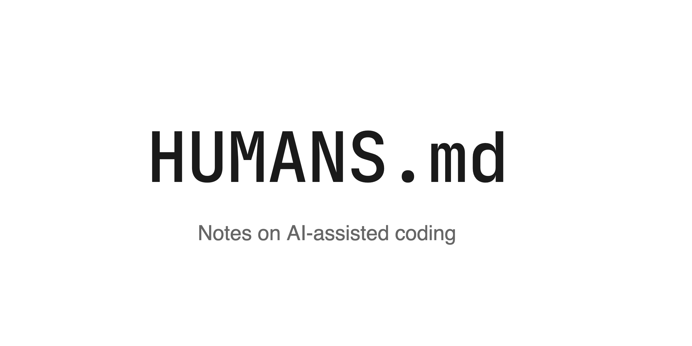

I've been working with AI coding agents a lot lately, and learning a lot in the process. I've noticed patterns: things that work well, things that don't, and small tricks that make the whole experience better.

This led to [pair.guide][1] (previously humans.md) - a collection of short, practical notes on pair-coding with AI. Just things I wish I'd figured out sooner.

[][1]

If you're working with Claude Code or similar tools, maybe you'll find something useful. And if you have tips of your own, contributions are welcome.

 [1]: https://pair.guide
