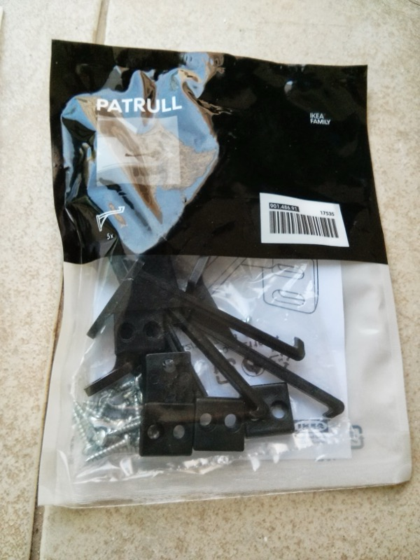

While going through my Mom&#8217;s old toolbox a few weeks ago, I found this:

 

Probably from around 1980, it&#8217;s the Patrull drawer safety catch from Ikea. The funny thing is that just a couple days before that, I bought [this][1]:

 

Same product, 30 years later!

It&#8217;s so interesting to see the two products side by side: the differences in style, packaging, and in the product itself are really telling. For example, notice how the old packaging has a textual description in a few languages, which I guess made sense since Ikea was only active in Europe in the early 80&#8217;s. Imagine if the current packaging had a description for [every country Ikea operates in][2] now!

The plastic itself has evolved quite a bit too &#8211; it&#8217;s much thinner now. The current pack contains 5 units, while the old one only has 3 &#8211; and in a much smaller package.

Makes me wonder how that product would look 30 years from now.

 [1]: http://www.ikea.com/ca/en/catalog/products/90148691/
 [2]: http://en.wikipedia.org/wiki/List_of_countries_with_IKEA_stores