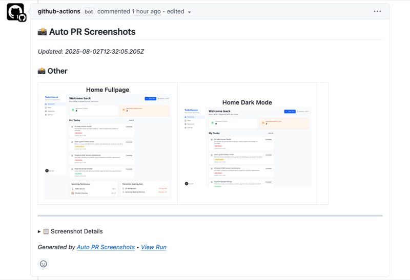

Being involved in projects with lots of PRs from AI coding agents, I realized that no matter how thoroughly I review the code, I still need a quick way to validate any visual changes.

Out of that need, I built a small GitHub Action now available on the marketplace: [auto-pr-screenshots][1].

Once it’s set up, it uses [Playwright][2] to generate screenshots and post them as a comment on the PR.

Here’s an example of how that looks:<figure class="wp-block-image size-large">

 </figure> 

#### Configuration {.wp-block-heading}

I’ve tried to keep configuration to a minimum:

In your workflow file, load your environment, then add the following step:

```yaml
- name: Auto PR Screenshots
  uses: yoavf/auto-pr-screenshots-action@v1.0.1-beta
  with:
    url: http://localhost:3000
```

If you’re using a popular framework like Next.js, the action will even try to auto-detect the URL.

By default, it captures the home page at both desktop and mobile viewports. But you can easily add more pages—or define custom steps to interact with the UI before taking a screenshot:

```yaml
screenshots:
  - name: home-mobile
    url: http://localhost:3000/
    viewport:
      width: 375
      height: 812
    waitFor: .task-list

  - name: add-task-desktop
    url: http://localhost:3000/
    viewport:
      width: 1280
      height: 800
    steps:
      - click: "[data-testid='add-task-button']"
      - waitFor: "[data-testid='task-form']"
```
  
If you’re curious or want to give it a try, the repo’s here: [yoavf/auto-pr-screenshots-action][3].

 [1]: https://github.com/marketplace/actions/auto-pr-screenshots
 [2]: https://playwright.dev/
 [3]: https://github.com/yoavf/auto-pr-screenshots-action