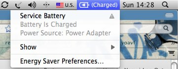

A couple of weeks ago my MacBook battery started to drain heavily when the computer was in sleep (standby) mode. This was really troubling &#8211; and while I was still getting a decent enough run on a full charge, a &#8220;Service Battery&#8221; notice also appeared on the power menu.

[][1]

The fix? A reset of the System Management Controller:

> In some cases, resetting the SMC may be the only correct method to resolve the issue, however, an SMC reset should only be attempted after all other standard troubleshooting has been performed.

From Apple support site,  _[Resetting the System Management Controller (SMC)][2]_

That didn&#8217;t remove the notice from the power menu, but the battery draining issue is gone.

 [1]: images/service-battery1.jpg
 [2]: http://support.apple.com/kb/HT3964?viewlocale=en_US