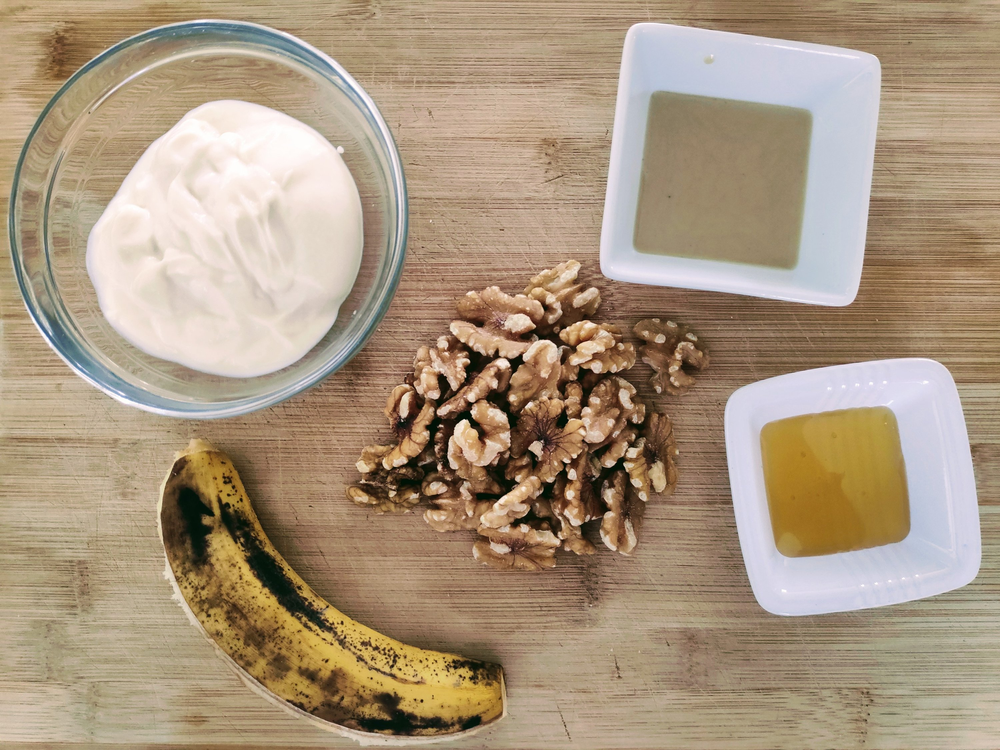

When it comes to food, I&#8217;m not a person of habits. But this recipe has been my breakfast of choice for the last few months, and surprisingly, I&#8217;m still enjoying it very much.

### Yoghurt with Tahini, Banana, Walnuts, and Honey {.wp-block-heading}

<figure class="recipe-image">
  
</figure>

  <h4>Breakfast Yoghurt with Tahini, Banana, Walnuts, and Honey</h4>
  
<strong>Servings:</strong> 1 | <strong>Prep time:</strong> 5 minutes

  <h5>Ingredients</h5>
  <ul>
    <li>125 gr yoghurt (I use dairy-free plain yoghurt)</li>
    <li>1 banana, sliced, diced, or smashed</li>
    <li>A handful of walnuts</li>
    <li>2 tsp raw tahini</li>
    <li>1 tsp honey</li>
  </ul>

  <h5>Directions</h5>
  <ol>
    <li>Pour yoghurt in bowl</li>
    <li>Add Tahini and mix</li>
    <li>Add banana</li>
    <li>Crush the walnuts in your hand (or chop to your preferred size), and add to the bowl</li>
    <li>Drizzle honey on top</li>
  </ol>

