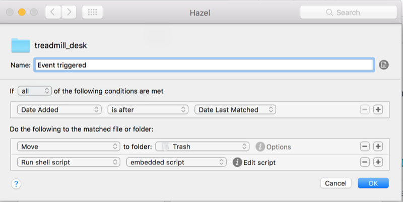

Having recently started using a treadmill desk, I wanted to automate actions on OS X as I switched from the regular desk to the treadmill. For example, turn on Bluetooth, switch the audio output device, etc. Sure, I can do that by creating an Automator script I&#8217;d run somehow, but I was curious to see if I could make it happen just by placing my phone on the treadmill desk.

Here&#8217;s how I do that using a few apps and utilities.

### Requirements:

  * [IFTTT][1] and [Dropbox][2] accounts (you don&#8217;t actually need the apps on your phone)
  *  Android: 
      * NFC capable phone, and NFC sticker
      * [Trigger][3]
  * OSX 
      * [Hazel][4]
      * [Dropbox][2]
      * [Blueutil][5] to toggle bluetooth
      * [Switchaudio-osx][6] to switch audio output device

### Setup

#### IFTTT

  1. Connect to the [Maker][7] and [Dropbox][8] channels.
  2. Note your Maker channel secret key
  3. Create a recipe with Maker&#8217;s [receive a web request trigger][9] and Dropbox&#8217;s [create a text file action][10]. You can use [this recipe][11] as a template. The file name&#8217;s and contents don&#8217;t matter. Choose a meaningful event name.
  4. Test your maker trigger url in the terminal with  
    [code lang=&#8221;bash&#8221;]  
    curl -X POST https://maker.ifttt.com/trigger/{event}/with/key/{key}  
    [/code]

#### Android

  1. Launch Trigger and add a new task.
  2. Add an NFC trigger and (in the following screen) any applicable restrictions.
  3. Add an action, and select &#8220;Open a URL/URI&#8221; under _Applications & Shortcuts._
  4. Enter your trigger url, and mark &#8220;Open in background&#8221;.
  5. When prompted, program your sticker.  
    **Note**: I&#8217;ve tried placing the sticker on the mac itself, but that didn&#8217;t work. I&#8217;m guessing there&#8217;s too much RF interference.  
    

#### OSX

Setup Hazel as follows:

  1. Add your new dropbox sub folder (in ifttt/maker/event_name, by default) to the Hazel folder list
  2. Add a folder rule for new files (see screenshot below). Add any actions you&#8217;d like to run: I move the file to the trash, and run an embedded shell script to launch some apps and command line utilities.  
    [][12]

That&#8217;s it! Every time you&#8217;ll place your phone on the NFC sticker, it&#8217;ll make an HTTP request, which will cause a file to be created in a dropbox folder. After the brief sync delay, Hazel will recognize the file and launch any actions you&#8217;ve told it too.

&nbsp;

 [1]: http://ifttt.com
 [2]: https://db.tt/ledHCb2p
 [3]: https://play.google.com/store/apps/details?id=com.jwsoft.nfcactionlauncher&hl=en
 [4]: https://www.noodlesoft.com/hazel.php
 [5]: http://www.frederikseiffert.de/blueutil/
 [6]: https://github.com/deweller/switchaudio-osx
 [7]: https://ifttt.com/maker
 [8]: https://ifttt.com/dropbox
 [9]: https://ifttt.com/channels/maker/triggers/1636368624-receive-a-web-request
 [10]: https://ifttt.com/channels/dropbox/actions/67-create-a-text-file
 [11]: https://ifttt.com/recipes/363591-create-file-in-dropbox-from-http-request
 [12]: images/syf1t9pgqu-3000x3000.png