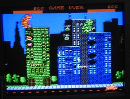

  
So apparently, the classic arcade game Rampage is being [adapted into a movie][1]. This brings back some memories: as a kid, my brother, a friend and I all sat together in front of the computer banging on the keyboard to bring those buildings down.

&nbsp;

We ended up breaking the keyboard, and my father formatted the _[diskette][2]._

 [1]: http://www.theverge.com/culture/2011/11/20/2575468/rampage-video-game-movie-development
 [2]: http://en.wikipedia.org/wiki/Floppy_disk