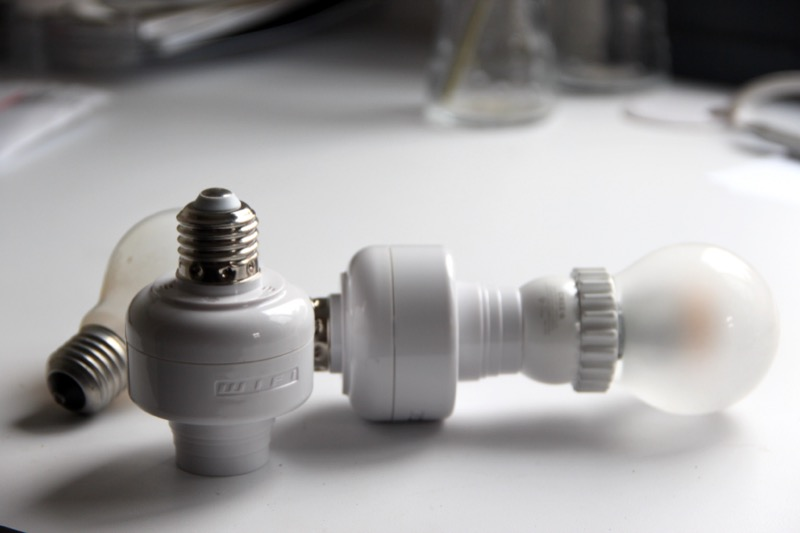

A few weeks ago I ordered some WF510 WIFI enabled E27 adapters. The WF510 is a device you place between your light fixture and your light bulb, that allows you to control the light with an iOS/Android app. At [$56 per lot of 3][1], they&#8217;re the poor man connected light bulb.

 

The reason I bought those adapters was to see if I could find out how the app controls the device, and build a better (open source!) app or web service around that. I always wanted to get more experience with home automation and device control.

When the package arrived yesterday, I was quick to plug one of the devices in and fire up [Wireshark][2] to see what was happening. Here&#8217;s what I found out:

All communications to and from the device are  over UDP port 5000 (The app send its packets directly to 255.255.255.255:5000). The packets contain bits of comma separated text encoded around the ascii table. I&#8217;m not sure if this method of encoding is known and documented, or if it&#8217;s proprietary to the manufacturer, but it works like this:

  * Each column of 32 characters in the table is encoded separately (i.e `` ` `` through `DEL`, and `@` to `_` )
  * For each set, the first 4 characters are shifted 12 places ahead. So `@` becomes `L` and `a` becomes `m`, and vice versa.
  * The next 4 characters are shifted 4 places ahead: `d` becomes `h` and `g` becomes `k`, and vice versa
  * Chars in positions 16 to 19 are shifted 12 places ahead as well. So `p` becomes `|` and P becomes `\`, and vice versa.
  * Chars in positions 20-23 are shifted 4 places ahead, so `t` becomes `x` and `{` becomes `w`

This took me a little while to figure out, but once I did the device no longer had any secrets for me.

#### Device setup:

To setup the device you connect to its own WIFI Access point (named WF510-MACADDRESS). You then sends it the credentials for your home network.  
Here&#8217;s the translated exchange between the app and the device:

App:  
`search //knock knock, who's there`

Device:  
`search,ACCF23022B80,leynew,WF510,room,\r\nOK-  // I'm ACCF23022B80, manufactured by leynew, model WF510, room(?)`

App:  
`ACCF23022B80,setonoff,0,254, // can you turn off so I can see you`

Device  
`setonoff,0\r\nOK- // sure`

App  
`ACCF23022B80,setonoff,1,254, // and on again?`

Device  
`setonoff,1\r\nOK- //sure`

App  
`ACCF23022B80,setnet,{network ssid},{network password},WPA2PSK,AES, // Here's the network you need to connect to, with WPA2PSK security and AES encryption (possible values are also WPAPSK and TKIP respectively)`

#### Device Control

Turn light off  
`ACCF23022B80,setbrightness,0,254,`

Turn light on  `ACCF23022B80,setbrightnes,100,254,`

Dim light to 50%  
`ACCF23022B80,setbrightness,50,254,` 

#### What&#8217;s next?

I plan to build a library to control the devices &#8211; not sure about the stack I&#8217;m going to use, but it&#8217;s definitely going to be something I haven&#8217;t used before.

 [1]: http://www.aliexpress.com/item/WF510-E27-WiFi-Lamp-Adapter-works-with-the-E27-triac-dimmable-high-power-led-bulbs/1587440292.html
 [2]: http://wireshark.org/