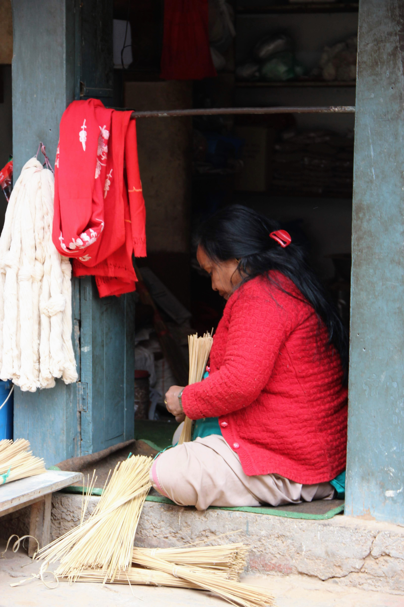

These pictures were taken during a short trip to Kathmandu, Nepal, in March 2019.

  

    Bhaktapur
  

<figure class="wp-block-gallery columns-3 is-cropped">
  <ul class="blocks-gallery-grid">
    <li class="blocks-gallery-item">
      <figure></figure>
    </li>
    <li class="blocks-gallery-item">
      <figure></figure>
    </li>
    <li class="blocks-gallery-item">
      <figure></figure>
    </li>
    <li class="blocks-gallery-item">
      <figure></figure>
    </li>
    <li class="blocks-gallery-item">
      <figure></figure>
    </li>
    <li class="blocks-gallery-item">
      <figure></figure>
    </li>
    <li class="blocks-gallery-item">
      <figure></figure>
    </li>
    <li class="blocks-gallery-item">
      <figure></figure>
    </li>
    <li class="blocks-gallery-item">
      <figure></figure>
    </li>
  </ul>
</figure>

  

    Pashupatinath Temple
  

<figure class="wp-block-gallery columns-3 is-cropped">
  <ul class="blocks-gallery-grid">
    <li class="blocks-gallery-item">
      <figure></figure>
    </li>
    <li class="blocks-gallery-item">
      <figure></figure>
    </li>
    <li class="blocks-gallery-item">
      <figure></figure>
    </li>
    <li class="blocks-gallery-item">
      <figure></figure>
    </li>
    <li class="blocks-gallery-item">
      <figure></figure>
    </li>
    <li class="blocks-gallery-item">
      <figure></figure>
    </li>
  </ul>
</figure>

  

    Swayambhunath (Monkey Temple)
  

<figure class="wp-block-gallery columns-4 is-cropped">
  <ul class="blocks-gallery-grid">
    <li class="blocks-gallery-item">
      <figure></figure>
    </li>
    <li class="blocks-gallery-item">
      <figure></figure>
    </li>
    <li class="blocks-gallery-item">
      <figure></figure>
    </li>
    <li class="blocks-gallery-item">
      <figure></figure>
    </li>
    <li class="blocks-gallery-item">
      <figure></figure>
    </li>
    <li class="blocks-gallery-item">
      <figure></figure>
    </li>
    <li class="blocks-gallery-item">
      <figure></figure>
    </li>
    <li class="blocks-gallery-item">
      <figure></figure>
    </li>
  </ul>
</figure>