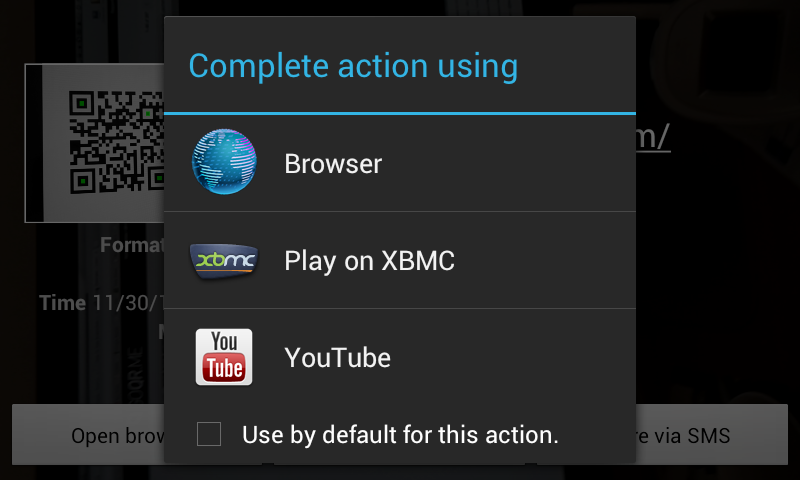

So we bought this fairly difficult to assemble product the other day, and on the package was a big QR Code. I scanned the code with my phone, and Android detected a link to a YouTube video and offered a few choices for playing it. One of those was &#8220;Play on XBMC&#8221;, thanks to the XBMC remote app (XBMC is the software that runs on our living room HTPC).

Instantly, <del>assembly instructions</del>&nbsp;a crappy promotional video&nbsp;started playing on the TV. This is the future? (A proper _how to_ video would have made this story so much better!)