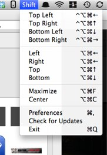

It took me some time to find these great apps, so I figured a mention might help others:

  * [Shift It][1] enables easy moving and resizing of windows using the keyboard (expands  the concept of Aero Snap)  
    [][2]
  * [Afloat][3] will let you keep windows on top, adjust window transparency and much more.  
    [][4]

In case you&#8217;re wondering, they&#8217;re both free _and_ open source.

**Continued:** [Laptop and Multiple Displays: Window Management on OS X][5]

Update 2014-02-03: The link to ShifIt has been updated and now points to the new repository on Github.

 [1]: https://github.com/fikovnik/ShiftIt
 [2]: images/shift1.jpg
 [3]: http://infinite-labs.net/afloat/
 [4]: images/afloat1.jpg
 [5]: http://blog.yoavfarhi.com/2010/10/14/laptop-multiple-displays-window-management/