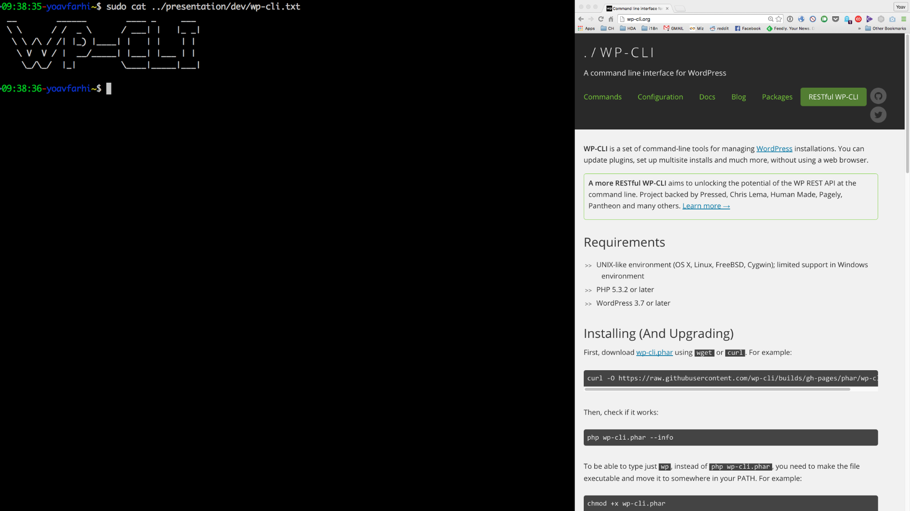

I recently gave a talk about [WP-CLI ][1]at [WordCamp Israel 2016][2]. I thought it would be interesting to actually demo WP-CLI in real time, rather than use boring slides.

I used OS X split screen mode, with a terminal window on one side, and a browser on the other showing the site I&#8217;m creating and editing:

[][3]

The tricky part was to **not** have to type the commands I wanted to demo (which would be boring, and slow). Luckily, I&#8217;ve found [doitlive][4], which takes a bash script and types the commands in a simulated window.

By default doitlive echos the characters one by one: the presenter just has to type randomly on his keyboard (_like a Madman!_).

But I wanted to be able to move on stage, and control the presentation using a remote. So I set doitlive&#8217;s speed option to a large number, and each command appeared with a single key press. I still needed a return to execute the command, a key not present on my remote. I worked around this by using [TextExpander][5] to replace &#8216;b&#8217; (from the &#8216;Black Screen&#8217; button) with a newline.

The result: each command required just two button presses. (The truth: I forgot to turn on TextExpander,  so I had to go back to the lectern for every single command. Bah.)

Some tips that might help if you&#8217;re planning to do something similar:

  * Use the \`-g\` param when opening a url in the browser to keep the focus on the terminal window
  * Write a cleanup/prep script that sets up your environment the way you need it before the demo (empty the db, delete or rename files, etc)
  * Rehearse. A lot. This is true for every presentation, but is a must with live demos.

Here&#8217;s the script I&#8217;ve used, split into commented sections. I&#8217;ll link to the video once it&#8217;s up on WordPress.tv.

doitlive config
```bash
#doitlive shell: /bin/bash  
#doitlive prompt: l33t {r\_angle.red}{r\_angle.yellow}{r_angle.green}  
#doitlive commentecho: true  
#doitlive speed: 1000  
```

Intro, using ascii art files
```bash
cat name.txt  
cat wp-cli.txt  
open http://wp-cli.org -g  
clear  
```

Demo site and WP-CLI download and setup
```bash

open http://wpcli.dev -g

#Download  
curl -O https://raw.githubusercontent.com/wp-cli/builds/gh-pages/phar/wp-cli.phar

\# Permission and move to path as &#8216;wp&#8217;  
chmod +x wp-cli.phar

sudo mv wp-cli.phar /usr/local/bin/wp

\# Test  
wp &#8211;info  
wp  
```

Cleanup before we start
```bash
cd mdocs  
mv index.html index.old  
clear  
```

Core download and installation
```bash
wp core download

ls -l

open http://wpcli.dev -g

wp core config &#8211;dbname=wpcli &#8211;dbuser=root &#8211;dbpass=root &#8211;dbhost=localhost &#8211;dbprefix=wpcli_

cat wp-config.php

wp core install &#8211;url=&#8221;http://wpcli.dev&#8221; &#8211;title=&#8221;WP-CLI Demo&#8221; &#8211;admin\_user=yoav &#8211;admin\_password=mypassword &#8211;admin_email=yoav@farhi.org

open http://wpcli.dev -g  
```

Language packs and updates
```bash
wp core language install he_IL &#8211;activate

open http://wpcli.dev -g

wp core update

wp core language activate en_US

clear  
```

Options
```bash
wp option update blogname &#8220;l33t wp-cli demo&#8221;

open http://wpcli.dev -g

clear  
```

Packages
```bash
wp package install aaemnnosttv/wp-cli-http-command

wp package list

clear  
```
Import theme unit test data
```bash
wp http get https://wpcom-themes.svn.automattic.com/demo/theme-unit-test-data.xml &#8211;scheme=https > theme-unit-test-data.xml

wp import theme-unit-test-data.xml &#8211;authors=create

wp plugin install wordpress-importer &#8211;activate

wp import theme-unit-test-data.xml &#8211;authors=create &#8211;skip=attachment

open http://wpcli.dev -g

clear  
```

Options using json format
```bash
wp option get sticky_posts

wp option update sticky_posts [] &#8211;format=json

open http://wpcli.dev -g

clear  
```

wp post generate
```bash
wp post generate &#8211;count=2

open http://wpcli.dev -g

clear

wp http get http://loripsum.net/api/5 | wp post generate &#8211;post_content &#8211;count=1

open http://wpcli.dev -g  
```

wp search-replace
```bash
wp search-replace Lorem WordPress

open http://wpcli.dev -g

clear  
```

wp scaffold
```bash
wp scaffold child-theme wpcli-child &#8211;parent\_theme=twentysixteen &#8211;author=&#8221;Yoav Farhi&#8221; &#8211;author\_uri=http://yoav.fr &#8211;activate

ls -l wp-content/themes/

ls -l wp-content/themes/wpcli-child

cat wp-content/themes/wpcli-child/style.css

open http://wpcli.dev -g

wp scaffold \_s wpcli\_s &#8211;theme_name=wpcli-s &#8211;author=&#8221;Yoav Farhi&#8221; &#8211;sassify &#8211;activate

ls -l wp-content/themes/

ls -l wp-content/themes/wpcli_s  
```
wp theme
```bash
wp theme list

wp theme activate twentyfourteen

open http://wpcli.dev -g

clear  
```
wp plugin and custom plugin commands
```bash
# wp plugin

wp plugin list

wp plugin install jetpack &#8211;activate

wp jetpack

wp jetpack module list

clear  
```
wp export
```bash
wp export

wp db export l33t-backup.sql

clear  
```

multisite
```bash
wp core multisite-convert

mv ms-rewrite-rules.txt .htaccess

wp site create &#8211;slug=msdemo

open http://wpcli.dev/msdemo -g

wp theme activate twentyfifteen &#8211;url=http://wpcli.dev/msdemo

open http://wpcli.dev/msdemo -g

clear  
```
custom commands
```bash
nano example-command.php

mkdir wp-content/mu-plugins  
cp example-command.php wp-content/mu-plugins/

wp example hello &#8220;Wordcamp Israel 2016&#8243;

clear  
```
wrap up
```bash
cd ../

cat thankyou.txt

\# Thanks for following! Questions?  
\# Typed using doitlive http://doitlive.readthedocs.org/  
```

Download [the full script][6].

 [1]: http://wp-cli.org/
 [2]: http://2016.israel.wordcamp.org
 [3]: images/wp-image-838682689png.png
 [4]: http://doitlive.readthedocs.org/en/latest/
 [5]: https://smilesoftware.com/textexpander
 [6]: https://cloudup.com/iDgFvpdBZPD