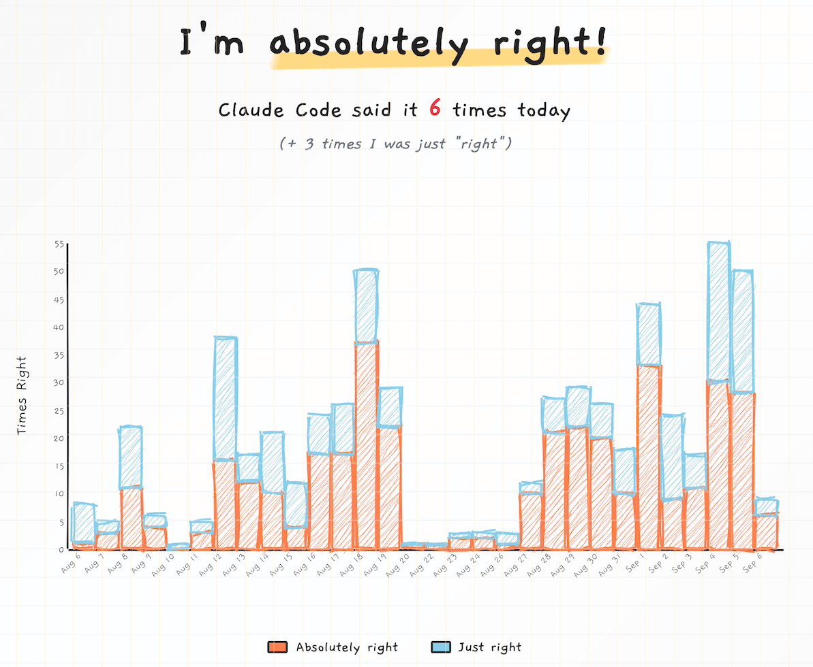

I had some fun a couple of nights ago creating a [silly website][1] that tracks how often Claude Code tells me "You're absolutely right!" during coding sessions.

I [open-sourced][2] it (of course) and posted it to Hacker News, thinking some people might enjoy the joke. 

Turns out I was absolutely right! 🤣

It hit number 2 on the HN front page and got over 100k page views in less than a day. I really enjoyed seeing how people noticed some of the small details I obsessed over.

Also: Rust + mostly vanilla JS FTW! The site never crossed 15% CPU utilization on the smallest [Fly.io][3] machine.

[1]: https://absolutelyright.lol/
[2]: https://github.com/yoavf/absolutelyright
[3]: https://fly.io